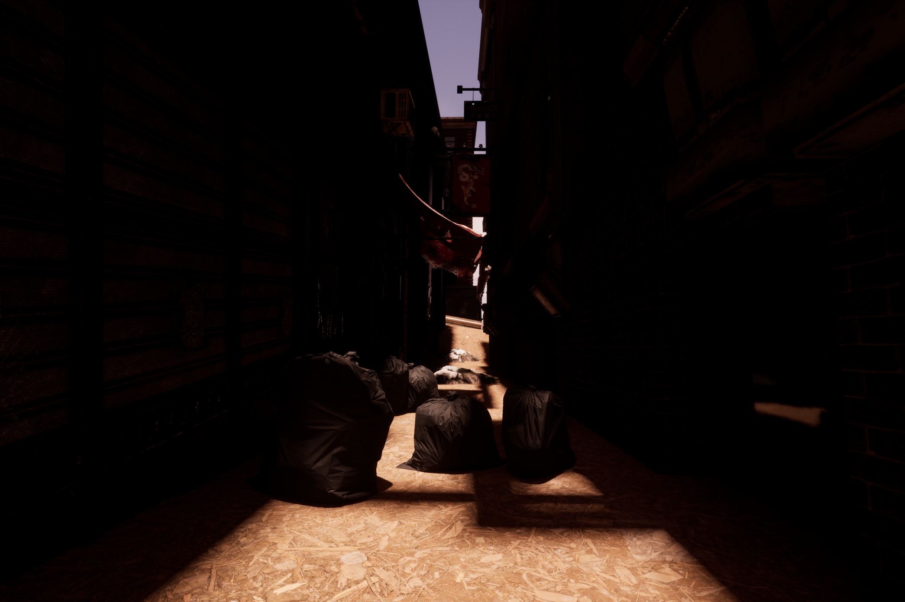
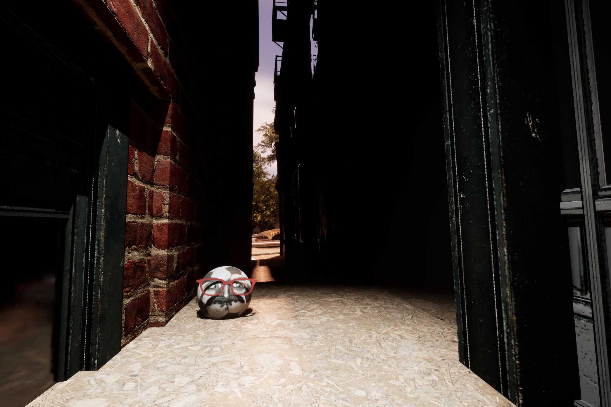

# Endgame
A video game demo created by [Advait Ukidve](https://github.com/AdvaitU) and [Mae Horak](https://github.com/mkh7878) for Creative Making: Advanced Visualisation and Computational Environments for the MSc. Creative Computing at UAL CCI.     
**Link to GitHub:** https://github.com/AdvaitU/endgame    
(June 2023)   
      
### Game Summary
Endgame is a video game based in a post-apocalyptic fictional London 50 years after the bombs fell in 2019. The game lets you take the control of AI-Football Harold as you navigate a post-nuclear fictional London gathering intelligence from your network of football-AI spy colleagues and report to release the overseer Erik Ten Haag from his long imprisonment in a telephone box. In order to win the game demo, the player must use the spherical controller built for the game to traverse London and find his colleagues. Each colleague gives a little part of the information necessary to free Erik Ten Haag to win the game.

### Technical Summary
The core idea of Endgame was to explore alternative control systems that tie in to the world of the game and examine how a player's perception adjusts to the affordances of their controls. The game runs using a custom built accelerometer based controller that lets the player assume the role of a ball both in game and in how they control it. The controller is built using an [Adafruit BNO055 9-Axis Absolute Orientation Sensor](https://learn.adafruit.com/adafruit-bno055-absolute-orientation-sensor/overview) connected to an Arduino Leonardo that communicates with [Unreal Engine 5.1](https://www.unrealengine.com/en-US/) real-time over Serial (thanks to [Ramiro Montes De Oca's](https://github.com/videofeedback) [SerialCOM Plugin](https://github.com/videofeedback/Unreal_Engine_SerialCOM_Plugin) for Unreal Engine).

### Video Documentation
- [Game Demonstration and Worldbuilding]() - () This video is a demonstration of the Game Design and World with extended lore, story setting, etc. with captured in-engine and in-game playthrough footage.
- [Technical Demonstration - Endgame in Action](https://youtu.be/DlGWNB3HCrw) - (~6 minutes) This video includes a demonstration of the spherical controller designed for the game in action along with captured in-engine footage + Level Design walkthroughs
- [Technical Documentation - How We Built It](https://youtu.be/J3sBT4w4Pwg) - (~12 Minutes long) This video is the extended technical documentation of the project and goes through a technical overview, the Arduino code, and all the Unreal Engine Blueprints required to create the game.

### This Repository
- [Worldbuilding](Worldbuilding.md) contains the lore we created for the world along with the extended story of the demo, and screenshots in sequence of building the level in Unreal Engine.
- [Technical Documentation](Technical_Documentation.md) contains detailed explanation of the code across platforms explained with screenshots
- [Arduino_Code](./Arduino_Code) contains the Arduino code used to carry out the functionality and a README explaining components. 
- The [Gallery](./Gallery/) Folder contains final demonstration images of Endgame (displayed below)
- The [Images](./Images/) Folder contains images used other readmes documenting the process of creating Endgame.
- [UE5.1_Blueprints](./UE5.1_Blueprints/) contains all the important Blueprints in the project as uasset files. These can be opened and reused in Unreal Engine 5.1.
- [AssetAttribution.md](AssetAttribution.md) contains credits to all authors whose wark was used in/learned from for the project.

### For Submission
This project was completed by Advait Ukidve and Mae Horak as a joint effort for the Creative Making: Advanced Visualisation and Computational Environments for the MSc. Creative Computing at UAL CCI. We both worked in various capacities across game design, development, prototyping, asset creation, etc. collaboratively:
**Both:** Unreal Blueprint Design, Worldbuilding, Gameplay Design and Testing
**Advait:** Arduino programming, Level Design, 3D Printing and Prototyping
**Mae:** Sound Design, 3D Asset Creation, 2D Visual Design.

## Gallery
The following are screenshots captured in-engine and in-game:    

   
   
   
   
   
   
   
   
   
   
   
   
   
  
