# Endgame
A video game demo created by [Advait Ukidve](https://github.com/AdvaitU) and [Mae Horak](https://github.com/mkh7878) for Creative Making: Advanced Visualisation and Computational Environments for the MSc. Creative Computing at UAL CCI.    
(May 2023)    
      
### Two Sentence Summary
Endgame is a video game based in a post-apocalyptic fictional London 50 years after the bombs fell in 2019. The game lets you take the control of AI-Football Harold as you navigate a post-nuclear fictional London gathering intelligence from your network of football-AI spy colleagues and report to release the overseer Erik Ten Haag from his long imprisonment in a telephone box.

### Technical Summary
The core idea of Endgame was to explore alternative control systems that tie in to the world of the game and examine how a player's perception adjusts to the affordances of their controls. The game runs using a custom built accelerometer based controller that lets the player assume the role of a ball both in game and in how they control it. The controller is built using an [Adafruit BNO055 9-Axis Absolute Orientation Sensor](https://learn.adafruit.com/adafruit-bno055-absolute-orientation-sensor/overview) connected to an Arduino Leonardo that communicates with [Unreal Engine 5.1](https://www.unrealengine.com/en-US/) real-time over Serial (thanks to [Ramiro Montes De Oca's](https://github.com/videofeedback) [SerialCOM Plugin](https://github.com/videofeedback/Unreal_Engine_SerialCOM_Plugin) for Unreal Engine).

**Link to GitHub:** https://github.com/AdvaitU/endgame

### Video Documentation
- [Game Demonstration and Worldbuilding]()
- [Technical Demonstration - Endgame in Action](https://youtu.be/DlGWNB3HCrw)
- [Technical Documentation and Explanation](https://youtu.be/J3sBT4w4Pwg) (~11 Minutes long)

### For Submission
This project was completed by Advait Ukidve and Mae Horak as a joint effort for the Creative Making: Advanced Visualisation and Computational Environments for the MSc. Creative Computing at UAL CCI. We both worked in various capacities across game design, development, prototyping, asset creation, etc. collaboratively:
**Both:** Unreal Blueprint Design, Level Design, Worldbuilding, Gameplay Design and Testing
**Advait:** Arduino programming, 3D Printing and Prototyping
**Mae:** Sound Design, 3D Asset Creation.

### This Repository
- [Arduino_Code](./Arduino_Code) contains the Arduino code used to carry out the functionality and a README explaining components. 
- The [Gallery](./Gallery/) Folder contains final demonstration images of Endgame
- The [Images](./Images/) Folder contains images used in this readme documenting the process of creating Endgame.
- [UE5.1_Blueprints](./UE5.1_Blueprints/) contains all the important Blueprints in the project as uasset files. These can be opened and reused in Unreal Engine 5.1.
- [AssetAttribution.md](AssetAttribution.md) contains credits to all authors whose wark was used in/learned from for the project.

# Project Documentation

## The Game
### The Idea
### The World and the Story
### Building the world visually
(2D posters created by Mae)

## Building the World

To build out the level, we used a top down method. We created the world with assets in the following order (Check out a quick video of the world getting built [here]():
1. Blockout Level
2. Roads and Topology
3. Buildings
4. Medium Scale Assets
5. Small Scale Assets
6. Decals and textures
7. Foliage
8. Non Playable Characters, Character Pawns, and SerialCOM actors
9. Music and sounds.
10. Lighting, environmental fogs, and camera postprocessing effects.     

### Blocking out the level
After the theme of the world was set, it was time to design to level. We designed the level to be a series of 6 paths the player must take in order to reach the final goal (for this demo). The aim was to get a grounding in fundamental level design and building techniques to create a demo version of the game that was compelling enough to play but still within the scope of being a polished version within the scope of a month. We started by creating a landscape of 16x18 blocks using Unreal's Landscape Tool and creating blocks in different colours to indicate the start of the player's journey (the football field), the buildings, the goals, etc. Creating rough sketches and brainstorming lead to the formulation of six 'journeys' the player must undertake (in any order) with topological, visual, and audio details, along with the unique control system and platforming making all these journeys interesting.

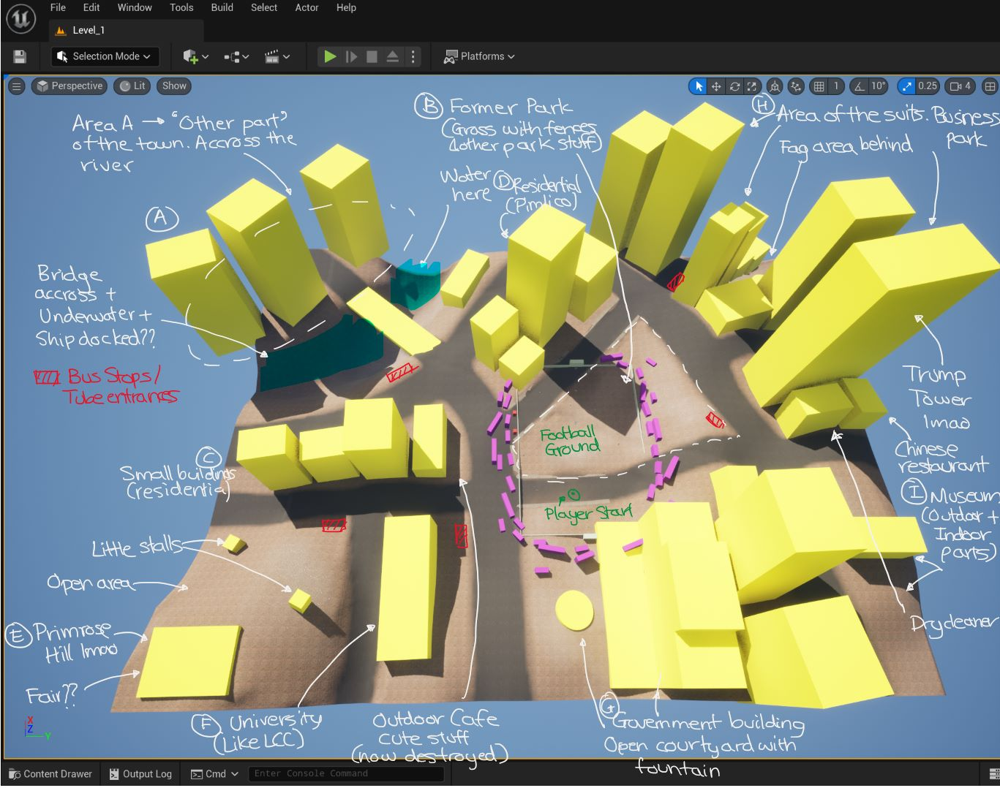

The map was divided into 5-6 main zones - the football field, the business park, the residential complex, 'across the bridge', the outdoor area/hill, the church, etc. We decided to create/source assets for all the zones in a way that retains their collective identity as being a part of the same city but reimagines them in the context of a post-apocalyptic rundown world to be visually compelling. We then laid the zones out with buildings and roads to map out the player's journeys

### Building the Landscape - Large Scale Meshes
The next thing to get right was the large scale assets of the city. We started out by laying down the roads by creating Landscape Splines and filling them in with an edited version of [this road mesh](https://sketchfab.com/3d-models/road-4eae882d72c24a789d83655f952008ea) complete with surface texture and painted middle lines (Huge thanks to [this tutorial](https://www.youtube.com/watch?v=eO2HUsC7dHY)). 

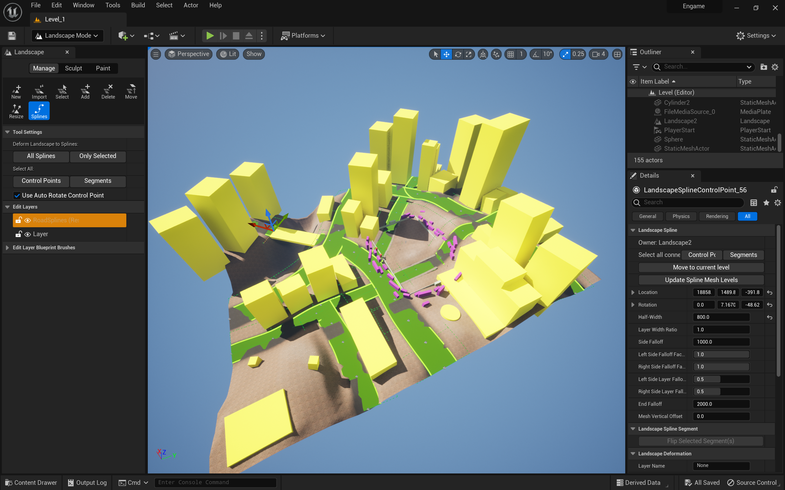   

Next, we surrounded the roads with footpaths and guard rails wherever appropriate (from Quixel Bridge).

   

Next, we used [PurePolygon's Modular Building Set](https://www.unrealengine.com/marketplace/en-US/product/modular-building-set) to create buildings with differing heights, footprints, and architectural styles to create a cohesive looking cityscape. The model for the church was thanks to [KitBash3D's](https://kitbash3d.com/) free asset library.

   

### Adding Smaller Scale Assets to Make the World Come to Life

The next step was to start adding in the medium scale assets into the world. This included destroyed vehicles, telephone boxes, trash bins, bus stops, street lamps, park lamps, decorative fences, statues, speakers, cupboards, park benches, street signs, fences, etc.

### Making the world our own

To then truly make the world our own, we created posters for post-apocalyptic shops, anti-sphere and pro-sphere propaganda, Raddington campaign posters, Erik Ten Haag posters and football posters for the ongoing match. These were created in a Soviet style using a range of Midjourney prompt-based generations edited to add detail, text, and noise and texture. Here's some of them. You can find all the posters in [this folder](./Gallery/Posters_and_Billboards/).

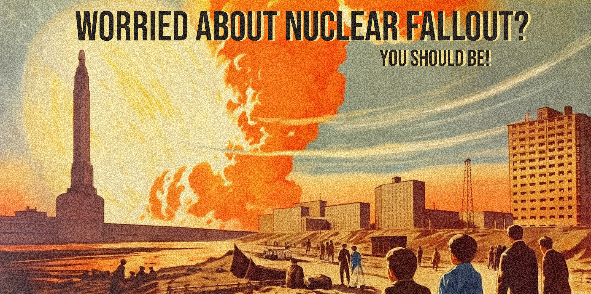 
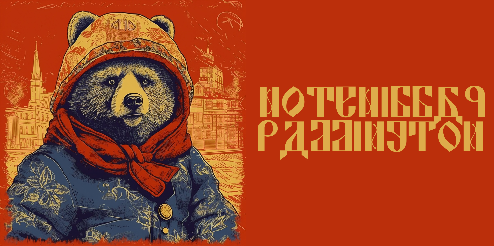 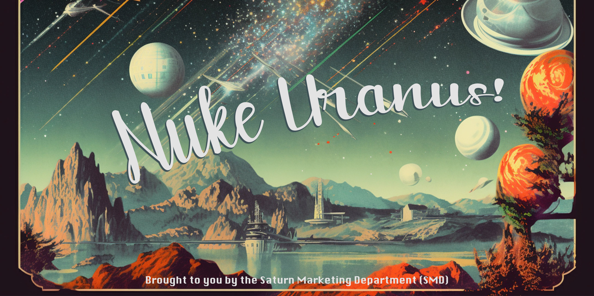
 
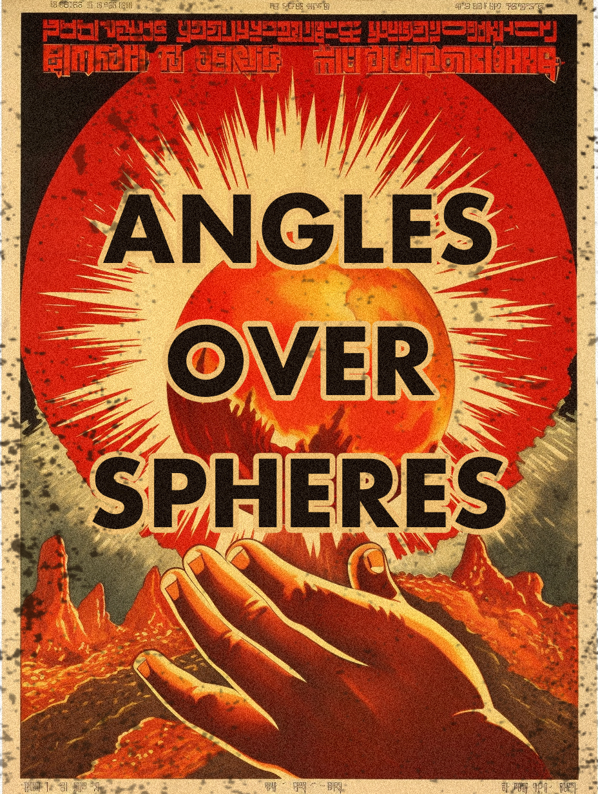 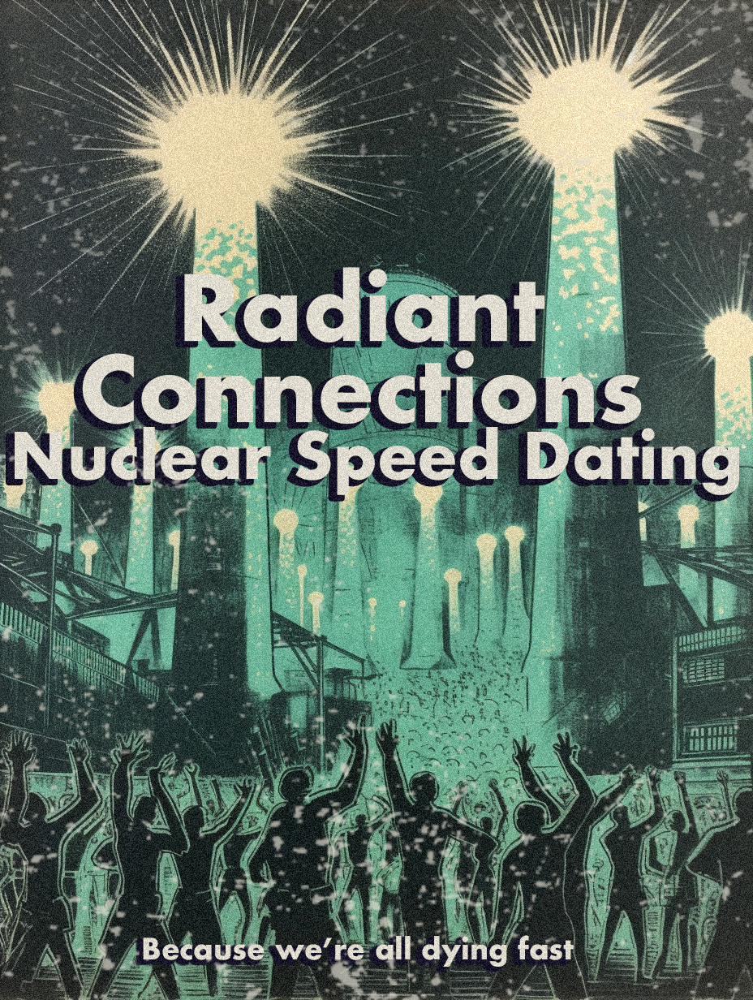 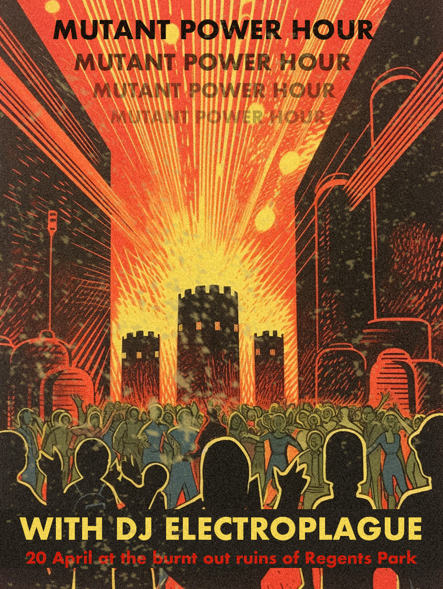 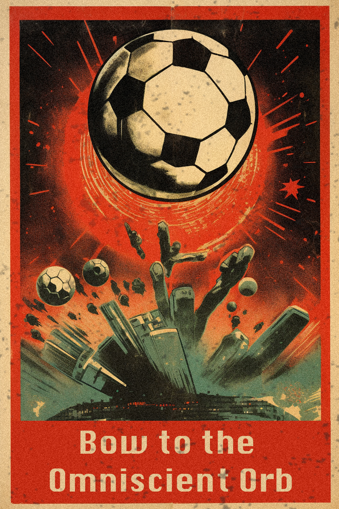

### Tweaking and Twisting
Then we added the decals to the world along with decals for surfaces like footpaths, stop signs, arrows, textures, blemishes, etc. to make the world more unique and believable.    

Following this, we added foliage to the world and saw it come to life in a way it simply hadn't before.

Finally, we added the sounds, lights, environmental effects and camera postprocessing effects to create the world the game is played in.   

   

## Getting code to do the thing

To build out the gameplay, we used an accelerometer connected to an Arduino communicating over Serial with Unreal Engine Blueprints to form the control system. Alongside this, other gameplay elements such as jumppads, popups, and platforming were also built using Blueprints.

- Before setting out to do any programming, we visualised what we would want to movemement controls to be like. We decided for a convenient, if not truly immersive experience, the ball would not roll, instead floating around at a low altitude to distinguish it as a sentient AI object and not simply a football.
- Next, we thought the control of the player in the engine should match semantically to the control of the ball interface in the player's hands. So the camera movements would be set to exactly mirror the ball controller the player is holding in their hands.
- After testing a little, we decided to remove any rotation along the y-axis (Vertical plane parallel to player's eyeballs) as the practicality of having the ball replicate movement along all three axes was causing confusing visuals and significantly more annoying controls. 
- We also decided that in order to move forward, the ball would have to be tilted away from the player akin to the following sketch:

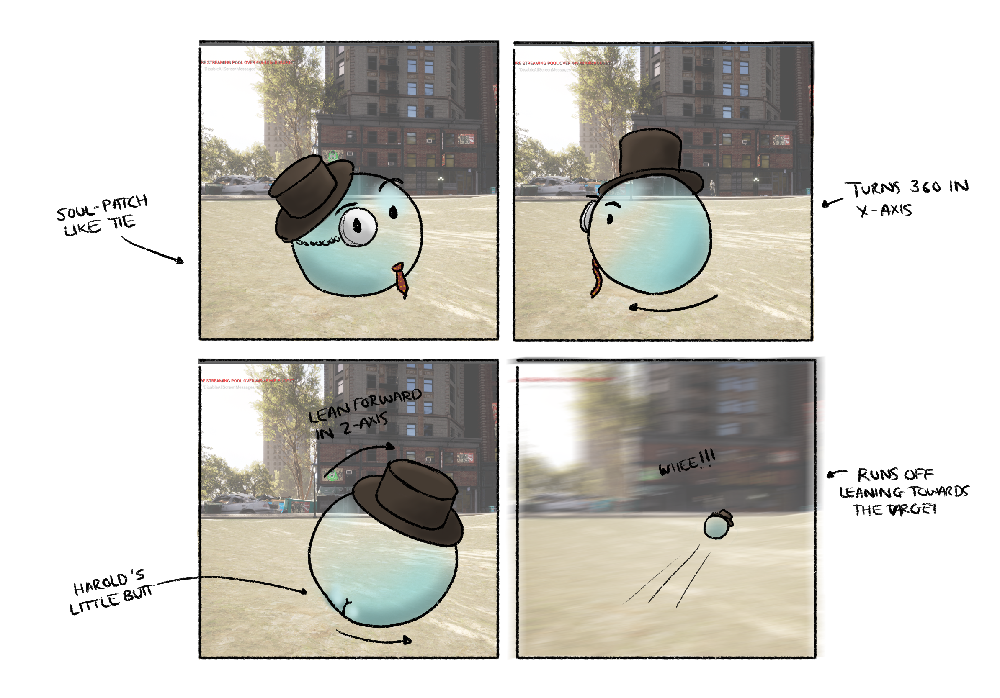 

### Technical Overview

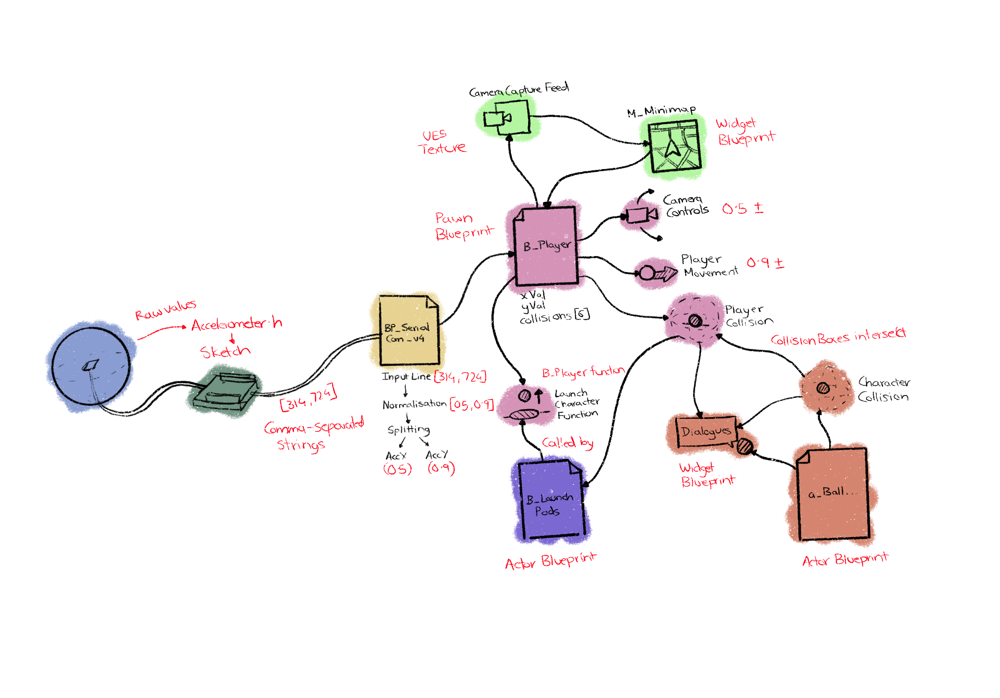  

### Arduino

This first step was to create the Arduino part of the control system. For this, we used an [Adafruit BNO055 9-Axis Absolute Orientation Sensor](https://learn.adafruit.com/adafruit-bno055-absolute-orientation-sensor/overview). The BNO055 is made easy to use by the Adafruit Unified Sensor and the Adafruit BNO055 libraries with communication with the Arduino managed over I2C. Unfortunately, the 'raw' values recieved for the BNO055 are formatted irregularyl with the x-axis (rotation along horizontal plane) mapped between 0 and 400, and the z-axis (rotation along vertical plane perpendicular to the player) mapped from -90 to 90.
In order to counter this problem as well as establish a modular string construction system to push to Serial, we created the [Accelerometer.h class](./Arduino_Code/Accelerometer.h)   

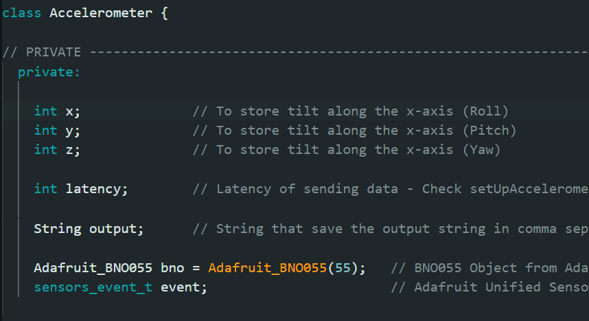  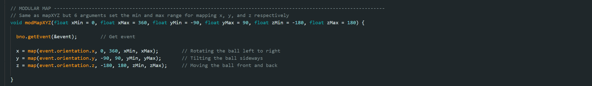  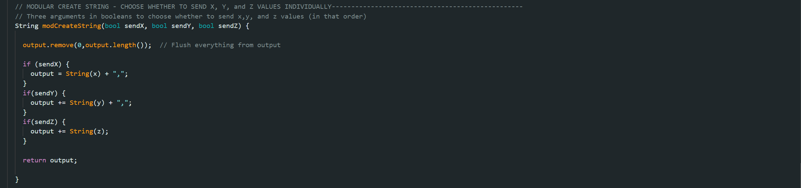  

The Accelerometer class includes functions that allow one to map x,y, and z axis rotation to more usable ranges (such as 0 to 360 degrees), set the frequency of communication over serial, create comma-separated strings to be sent over serial modularly, etc. (Complete documentation is in the header file).   
Through this class, we were able to send the x-axis and z-axis rotation (the only two required to create the control system) in the format "x,z" - each mapped from 0 to 720 for increased fidelity.

### Creating the Controller

Next, we worked on creating an actual interface to play the game. The interface is intentionally simple - taking the form of a sphere that one can hold upright and move to mirror the movement of the ball in-game. We designed and 3D printed the controller using Fusion 360 and Ultimaker Cura.   

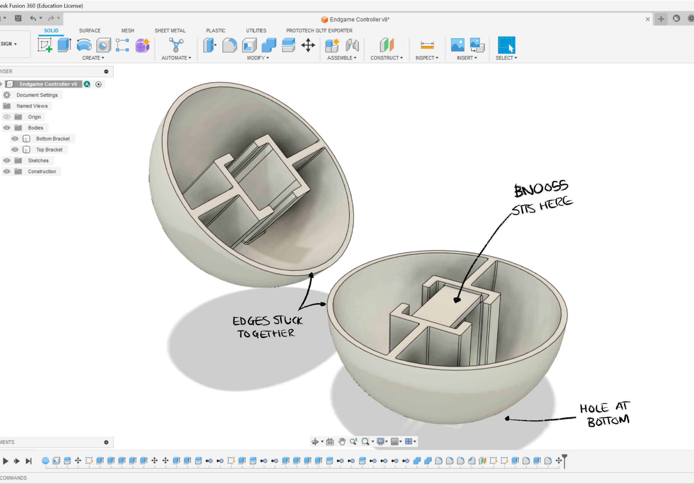 

### Unreal Engine

Next, we created a separate Unreal Engine project to create the Blueprints necessary and test out the controller. See video demo [here]().

The gameplay is created using multiple different blueprints:
1. **BP_SerialCom_v4_UE510** - Handles Serial Communication and is placed as an invisible actor in the level.
2. **B_Player** - Handles player movement, camera control, and minimap widget and receives input from BP_SerialCom_v4_UE510
3. **B_Launchpad** - Handles other functionality in the level as the player collides with it.
4. **x_Ball** - Collection of actor Blueprints that handle the other Ball charcaters and their dialogues

#### 1. [BP_SerialCom_v4_UE510](./UE5.1_Blueprints/BP_SerialCom_v4_UE510.uasset)
To establish communication over Serial, we used [Ramiro Montes De Oca's](https://github.com/videofeedback) open source [SerialCOM Plugin](https://github.com/videofeedback/Unreal_Engine_SerialCOM_Plugin) for Unreal Engine. This plugin comes bundled with functions tied to Gameplay Begins and Event Ticks that open up the Serial Port in Unreal and establish two-way communication with the Arduino. Building off of these functions, we created a custom sequence of code triggered on every Event Tick:   

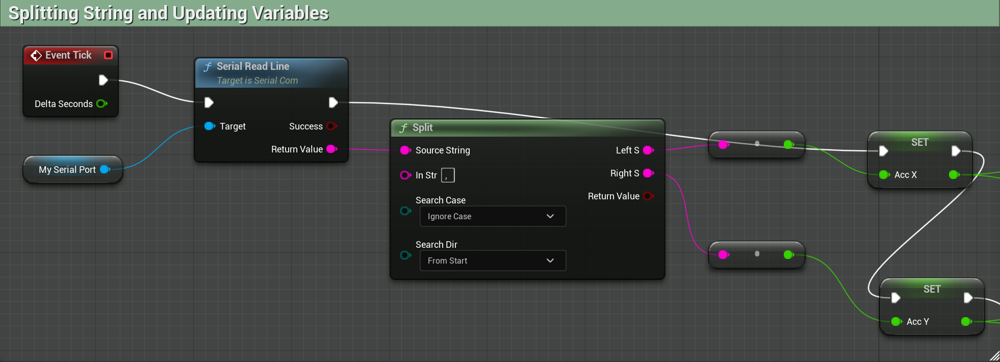 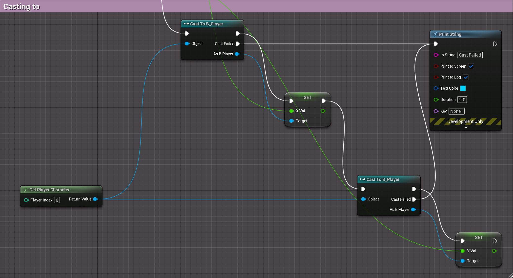

When the event tick is registered, the code reads a single line from the Serial Port and splits the string at the comma to give two distinct values - AccX and AccY - converted to floats. These two values are then cast to the B_Player class blueprint and written in the B_Player variables xVal and yVal respectively.

#### 2. [B_Player](./UE5.1_Blueprints/B_Player.uasset)

##### Camera Rotation
B_Player receives two separate values from the SerialCom blueprint. First, it divides both by 2 to normalise them in the required range of 0-360 as floats. The values are fed into a rotator object directly (as the y-axis and z-axis rotations - Unreal follows different defaults of axis names apparently). The values are also saved as lastValX and lastValY which create another rotator object together. On every Event Tick, the two created rotators (newly recieved values and previous values) are LERP-ed to create a smoother camera rotation around the player. Huge thanks to Lindsay Schardon's tutorial on Game Dev Academy for helping me create this. You can find it [here](https://gamedevacademy.org/unreal-engine-camera-tutorial/).

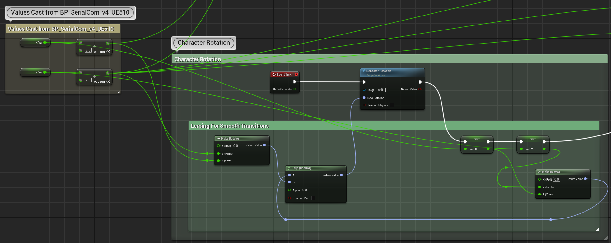   

##### Camera Snapping for Better Viewing
The camera is set to a standard spring arm of 2.5 metres in the Unreal level. If an object is detected between the camera and the player's mesh, the camera snaps to the player mesh instead creating a first person view. This helps when the player wants to look at objects high up in the level that is otherwise impossible with a spring arm of the length.   

##### Character Movement
In order to translate forward, the blueprint checks whether yVal (vertical rotation perpendicular to player's eyeballs) is less than 170 degrres from the ground. If it is less than 170, the ball starts translating along the actor's forward axis at a scale of 1.0. If the tilt goes below 150 degrees, the scale is shifted to 2.0 and the ball translates much faster.

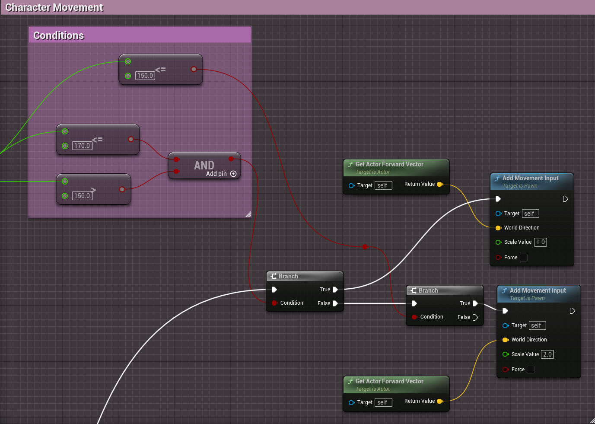   

##### Minimap

Additionally, the Blueprint also handles the Minimap functionality. For this, we created an orthographic camera that sits above the player and is invisible in the scene to the player camera. This camera captures the live view from its position and relays it to a widget blueprint containing the captured footage as a texture. This widget blueprint is initialised from B_Player on game start and updated every tick.

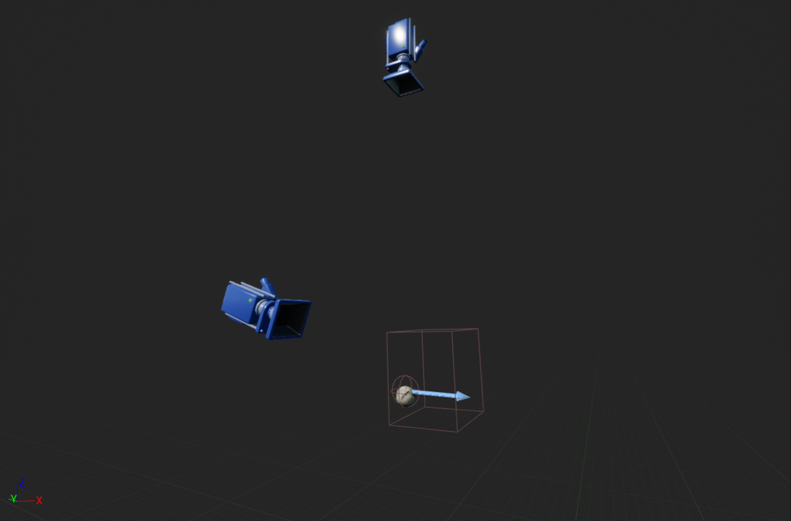   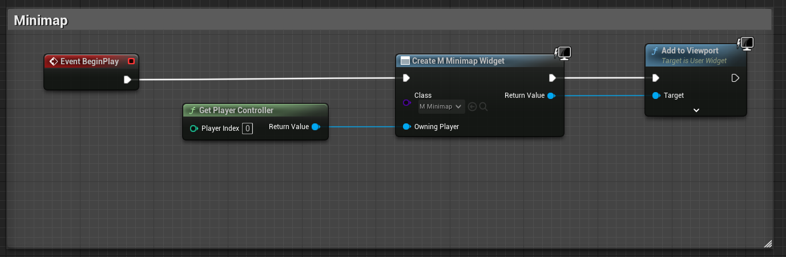  

(Thanks to Gorka Games' [tutorial](https://www.youtube.com/watch?v=VzFAujhMdEA) for this)

#### 3. [B_Launchpad](./UE5.1_Blueprints/BP_Launchpad.uasset)

The game also contains launch pads in the form of manhole covers that launch Harold into the sky in order to reach his targets, some of whom sit on rooftops. The launchpad contains a manhole cover as the mesh with a collision sphere around it roughly the same diameter. On the overlap of the B_Player, it casts to B_Player and calls an inbuilt function called LaunchCharacter to launch Harold into the sky at a height randomised between 1 and 4 units.   

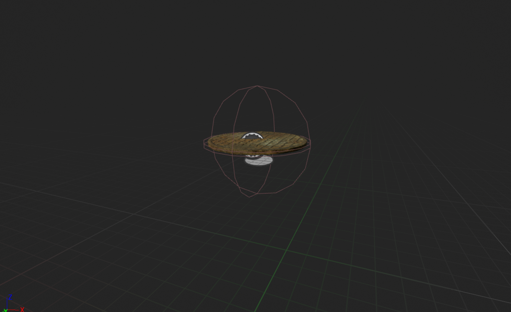  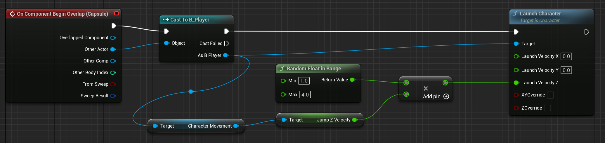    

(Thanks to Buvesa Game Development's [tutorial](https://www.youtube.com/watch?v=v_8qILc9wrI) for this)

#### 4. [x_Ball](./UE5.1_Blueprints/a_Ball.uasset)

Finally, the x_Ball (a_Ball, b_Ball...f_Ball + eth_Ball) Blueprints control the characters Harold has to meet throught the course of the game. Each ball except eth_Ball follows a similar scripts. Character meshes are accompannied by large collission spheres that set off events when the player starts and stops overlapping with them. On the beginning of play, each blueprint instantiates its respective dialogue widget blueprint and adds it to the viewport with default visibility off. On collission with the player, the Blueprint casts to B_Player and sets the visibility on and changes the respective boolean for recording the collision from false to true. On the end of overlapping, another event is called which sets the visibility back to hidden.   
[eth_ball](./UE5.1_Blueprints/eth_Ball.uasset) handles the game end state. It has the same functionality but only activates its dialogue after checking to see if all the booleans in the character collission array are true. This ensures that the player can speak to Erik Ten Haag and end the demo after they have interacted with every other agent and got the information necessary for the venture.   

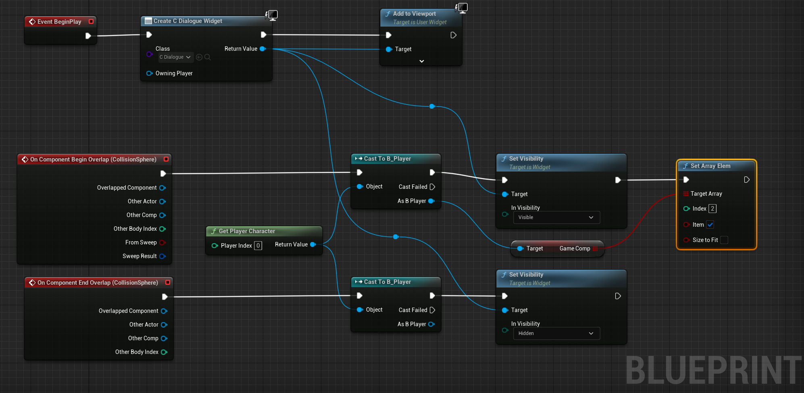  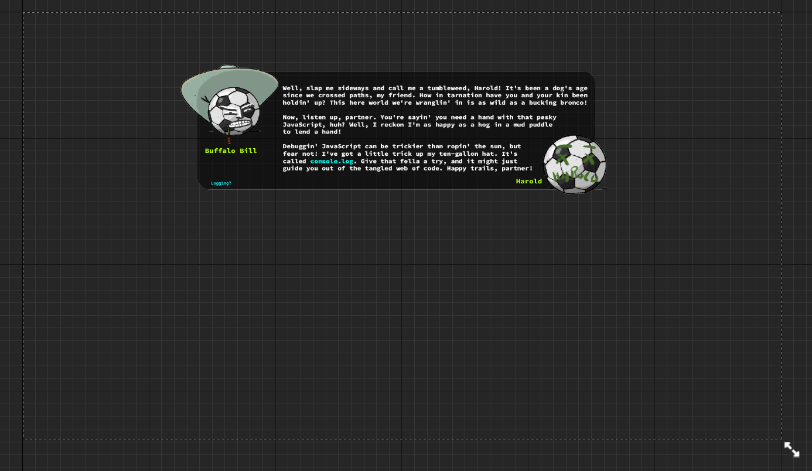  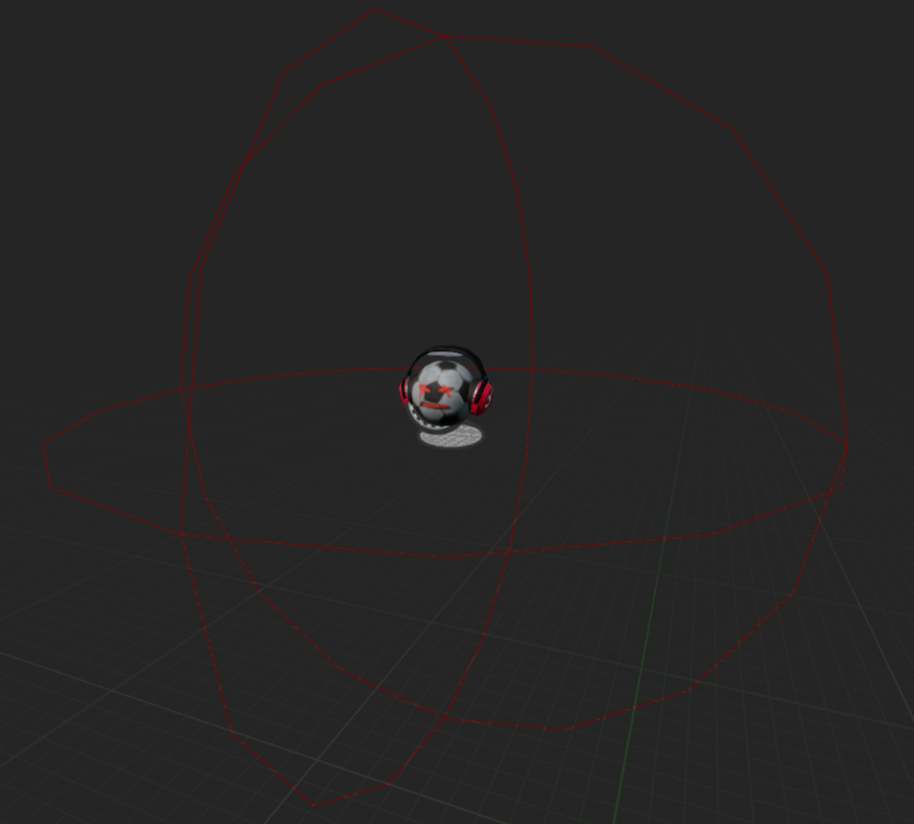  

(Thanks to Jake Ogden's wonderful [tutorial](https://www.youtube.com/watch?v=PcG0l3fPbps) for this)

## Sound Design

Thanks to Kiri Rodenburg for voicing every single character in the game - each in a unique voice and accent.    

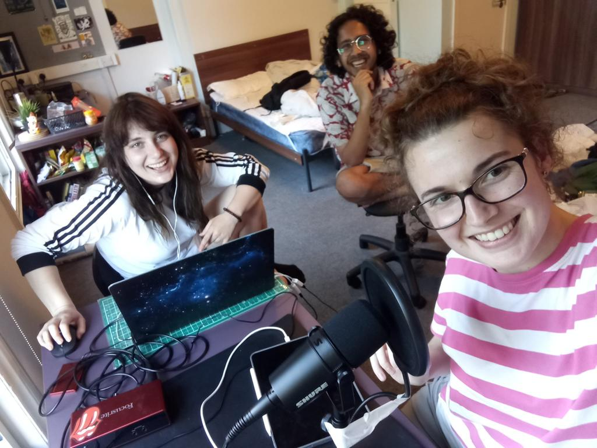  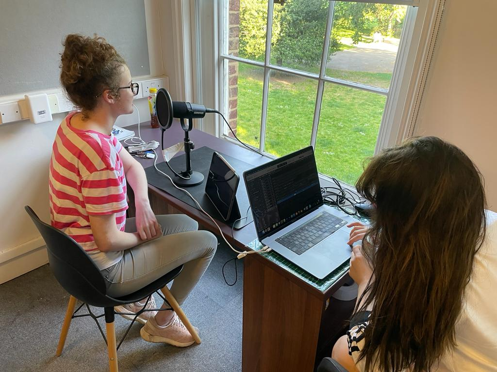     

We edited the recording to trim and modulate the pitch and triggered them in the same blueprints that triggered dialogue popups. We also added ambient sounds, and sound effects as appropriate throughout the world to create the game's atmosphere.
