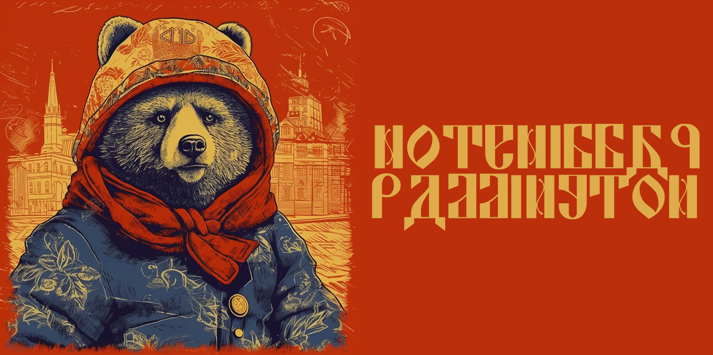
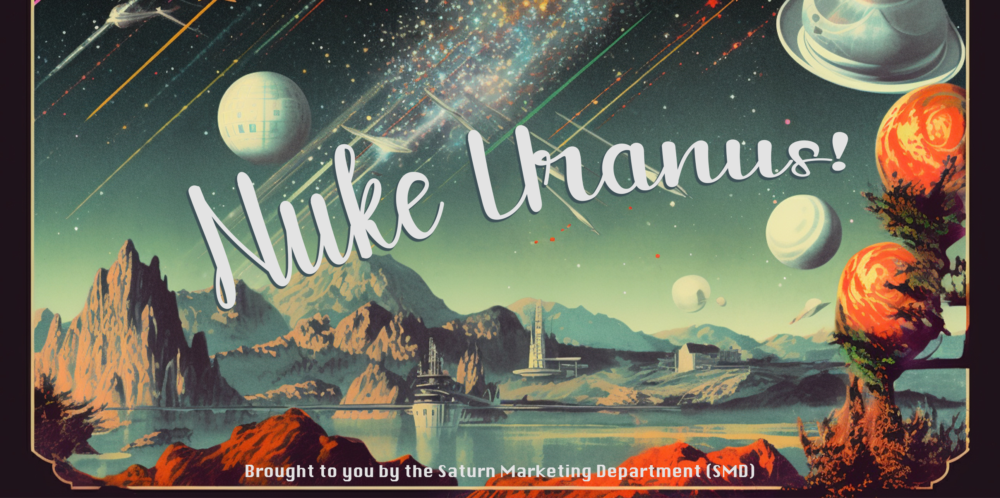
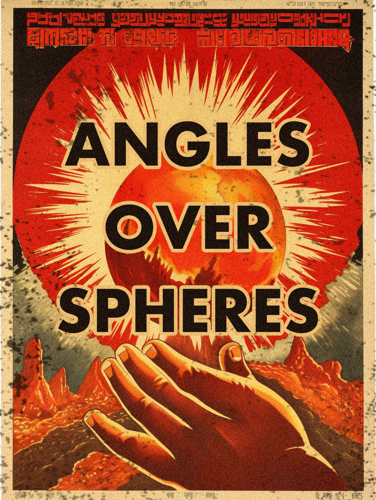
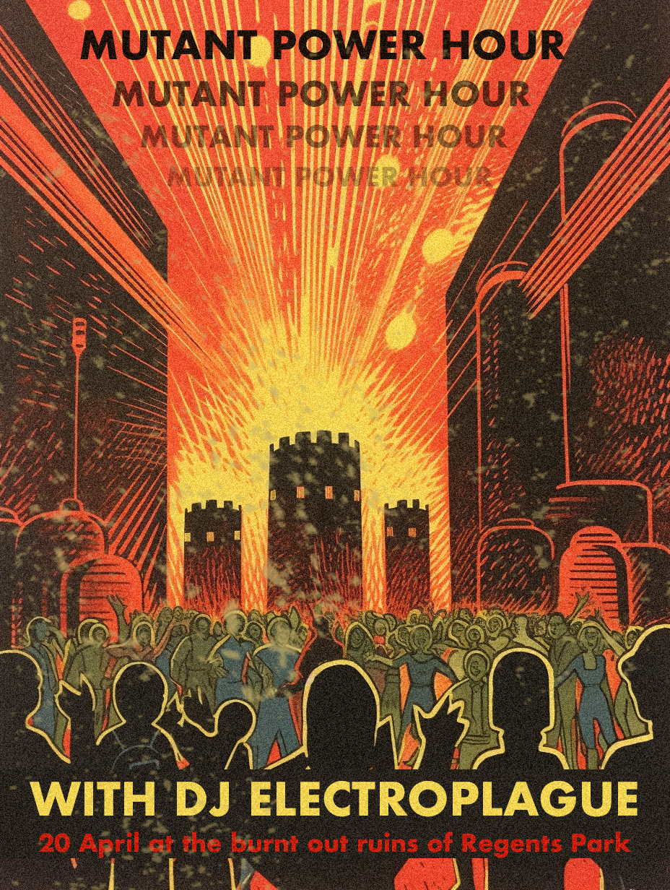

# WorldBuilding

## The Game
### The Idea
### The World and the Story
### Building the world visually
(2D posters created by Mae)

## Building the World

To build out the level, we used a top down method. We created the world with assets in the following order (Check out a quick video of the world getting built [here](https://youtu.be/DlGWNB3HCrw):
1. Blockout Level
2. Roads and Topology
3. Buildings
4. Medium Scale Assets
5. Small Scale Assets
6. Decals and textures
7. Foliage
8. Non Playable Characters, Character Pawns, and SerialCOM actors
9. Music and sounds.
10. Lighting, environmental fogs, and camera postprocessing effects.     

### Blocking out the level
After the theme of the world was set, it was time to design to level. We designed the level to be a series of 6 paths the player must take in order to reach the final goal (for this demo). The aim was to get a grounding in fundamental level design and building techniques to create a demo version of the game that was compelling enough to play but still within the scope of being a polished version within the scope of a month. We started by creating a landscape of 16x18 blocks using Unreal's Landscape Tool and creating blocks in different colours to indicate the start of the player's journey (the football field), the buildings, the goals, etc. Creating rough sketches and brainstorming lead to the formulation of six 'journeys' the player must undertake (in any order) with topological, visual, and audio details, along with the unique control system and platforming making all these journeys interesting.

The map was divided into 5-6 main zones - the football field, the business park, the residential complex, 'across the bridge', the outdoor area/hill, the church, etc. We decided to create/source assets for all the zones in a way that retains their collective identity as being a part of the same city but reimagines them in the context of a post-apocalyptic rundown world to be visually compelling. We then laid the zones out with buildings and roads to map out the player's journeys

### Building the Landscape - Large Scale Meshes
The next thing to get right was the large scale assets of the city. We started out by laying down the roads by creating Landscape Splines and filling them in with an edited version of [this road mesh](https://sketchfab.com/3d-models/road-4eae882d72c24a789d83655f952008ea) complete with surface texture and painted middle lines (Huge thanks to [this tutorial](https://www.youtube.com/watch?v=eO2HUsC7dHY)). 

Next, we surrounded the roads with footpaths and guard rails wherever appropriate (from Quixel Bridge).

Next, we used [PurePolygon's Modular Building Set](https://www.unrealengine.com/marketplace/en-US/product/modular-building-set) to create buildings with differing heights, footprints, and architectural styles to create a cohesive looking cityscape. The model for the church was thanks to [KitBash3D's](https://kitbash3d.com/) free asset library.

### Adding Smaller Scale Assets to Make the World Come to Life

The next step was to start adding in the medium scale assets into the world. This included destroyed vehicles, telephone boxes, trash bins, bus stops, street lamps, park lamps, decorative fences, statues, speakers, cupboards, park benches, street signs, fences, etc.

### Making the world our own

To then truly make the world our own, we created posters for post-apocalyptic shops, anti-sphere and pro-sphere propaganda, Raddington campaign posters, Erik Ten Haag posters and football posters for the ongoing match. These were created in a Soviet style using a range of Midjourney prompt-based generations edited to add detail, text, and noise and texture. Here's some of them. You can find all the posters in [this folder](./Gallery/Posters_and_Billboards/).

 
 
 
   

### Tweaking and Twisting
Then we added the decals to the world along with decals for surfaces like footpaths, stop signs, arrows, textures, blemishes, etc. to make the world more unique and believable.    

Following this, we added foliage to the world and saw it come to life in a way it simply hadn't before.

Finally, we added the sounds, lights, environmental effects and camera postprocessing effects to create the world the game is played in.   
