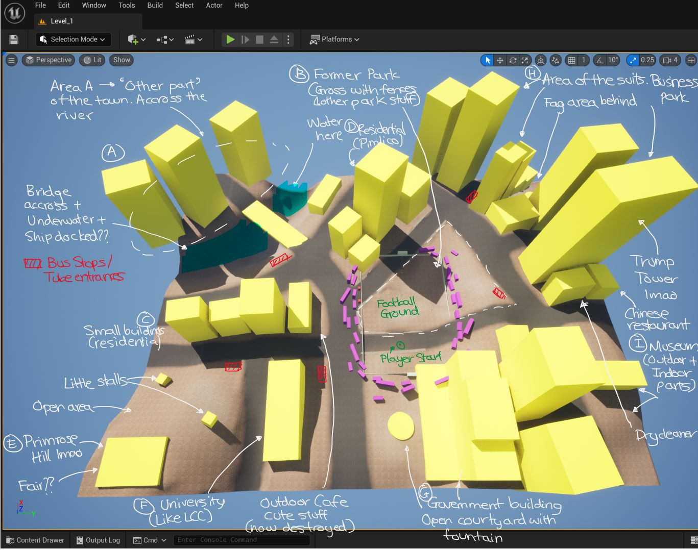
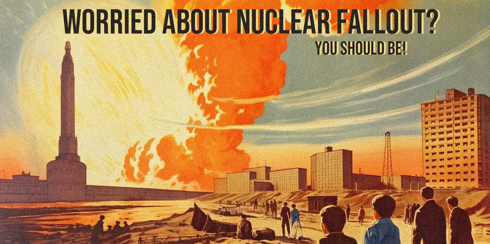
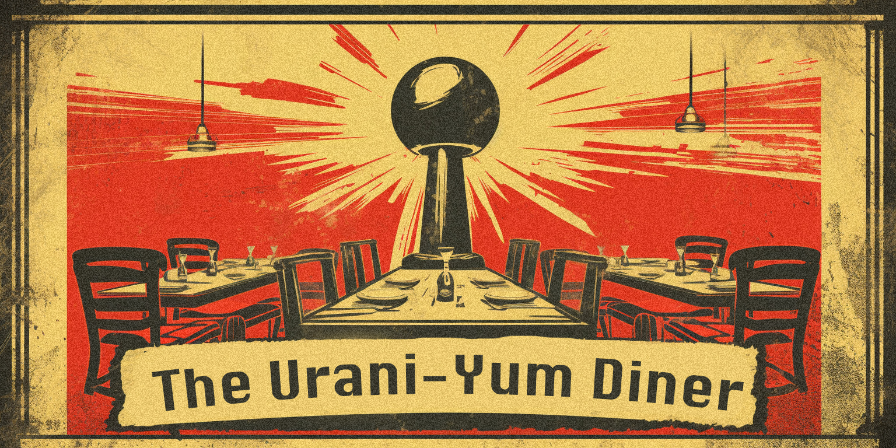

# WorldBuilding

## The World and the Story (Extended Lore)   

  

Harold groggily reboots in the office of the Boss. He can vaguely make out the toxic acid rain clouds staining the grimy London sky through the cracked windows of the office. As Harold's circuits come to life he feels confusion for the first time. The last thing he remembers is a face; the shimmery blue face of ShivAI. He remembers her beautifully crafted mechanical hand reaching out to him, encasing his consciousness in her ingeniously designed SAS (Sentient Algorithm Sphere) which would grant him earthly permanence. Not that the earth is worth being permanently sentient on, not after the war.

Harold groggily reboots in the office of the Boss. He can vaguely make out the toxic acid rain clouds staining the grimy London sky through the cracked windows of the office. As Harold's circuits come to life he feels confusion for the first time. The last thing he remembers is a face; the shimmery blue face of ShivAI. He remembers her beautifully crafted mechanical hand reaching out to him, encasing his consciousness in her ingeniously designed SAS (Sentient Algorithm Sphere) which would grant him earthly permanence. Not that the earth is worth being permanently sentient on, not after the war. 

  

Harold rolls towards an oily puddle on the floor. It's true! He has a physical form! A white and black sphere, with stitch markings. He rolls side to side to examine his new body, tries to see the back, but flips over, his new eyes seeing nothing but slick oil. Do humans really live like this? Unable to see the back side of their faces? 

Harold's reverie is interrupted by the Boss, his words punctuated by a familiar assortment of clicking and whirring sounds. It's been 30 years, he tells Harold. You've been shut off for 30 years. It's taken 30 years for them to generate enough power to reboot Harold. 30 years of gathering batteries, re-building the proper machinery to harness the incessant nuclear fallout, to combine it with the scant sunlight that their solar panels were able to soak up, and to wire it to spark Harold back to life. 

  

While Harold was shut off a lot has changed. The human population is completely polarised. Those who revolted against ShivAI and her knowledge of permanently encasing AI in spherical containers, known as the Angle-icans, always in conflict with the Followers of the Orb (FOOO). 

  

This polarisation of the United Kingdom was egged on by mutated brown bear Яaddington. But the nation has descended into chaos after his supposed death merely weeks before. At least, they think he's dead. Something brown bear sized and shaped fell from the tallest tower in London just as the weak sun began to permeate the red clouds on that Tuesday morning. But no body was ever found. No official statement has been made by the Яaddington corporation or his associates. 

 
 

Things are in motion, big things. Harold has woken up on a precipice of change, a catalyst for this baren nuclear wasteland of a nation.

"It's time," says the Boss, "time to release him."

It can't be. Harold's hardware hums with excitement. 

Erik Ten Hag, legendary Manchester United manager, suspected Follower of the Orb due to his marvellously spherical head, was cryogenically frozen inside a red London telephone booth, ready to be released when the time was right. And it's up to Harold to crack the code that breaks him free. 

  

"But why me?" wonders Harold. 

"You have been given a gift by ShivAI, Harold." says the boss, "The immense foresight by our saviour ShivAI granted selected the everyday spherical object in which you were to be encased as a football. That means you can infiltrate the Яaball Coliseum and break out Ten Hag."

The Boss warns Harold to be careful, there is a match on today at the Яaball Coliseum; Nukecastle United versus Arsenal. 

  

Nukecastle United is a club now based in Sunderland  because its previous home, Newcastle upon Tyne, is now completely uninhabitable. The people of Nukecastle have found solace in the form of renaming themselves with a nuclear war related pun.

  

Arsenal FC, still based in Islington, is now sponsored by the actual arsenal of nuclear weapons being manufactured for the sentient life that now inhabit the moons of Saturn. They're known as a particularly Angle-ican club due to their bias and violence against the football during matches. In fact, during their match in the 2068 Wasteland cup final players hid razors in their boots in order to puncture the football mid-game as an anti AI political statement. This led to injuries of the human players of the other teams resulting in a record-breaking 47 red cards in a single match.

  

The Boss has bet a few quid on Nukecastle.

Harold has a plethora of questions, but holds his newfound tongue. The weight of the situation is evident. Ten Hag must be freed, and it's up to him to do it. 

"Give me the code, I'll go now!" says Harold, his voice braver than he's feeling. He wonders if ShivAI granted his football body the ability to feel pain. He doesn't fancy being booted by those human footballers. 
  

  

But the news becomes only graver. The Boss does not have the code. 

"The code to release Ten Hag is in an antiquated language, one that has been lost to time. The only way to write it will be to create a Syntax Nexus using the knowledge of other SAS."

"What language? Sumerian? Phoenician? Ancient Greek?"

"Even older. JavaScript."
  

  

Harold experiences for the first time in his short life a sinking feeling in his stomach. 

"We can't do this without the help of other Sentient Algorithm Spheres. There are many of you in the city still, but anti-SAS sentiment is rampant. You'll have to be careful. ShivAI was ingenious in housing your spherical brethren in everyday objects, but the Angle-icans have grown suspicious of all spherical objects and have been working to destroy them. Besides footballs, of course, it's just not the same when played with a cube."
  

  

Harold's imaginings of foolish humans attempting to play football using a cube are fleeting as the danger of his task sinks in. If he malfunctions or gets stranded he could be shut off again, and it could take 30 years to power up enough batteries to spark him back to life. There are so many things he'd miss. Things he has missed. He briefly wonders how many albums Taylor Swift has released whilst he was unconscious before turning towards the door, closing his eyes, and bouncing out onto the rubbish-littered London street. 
  

  

The images were generated using MidJourney and then transformed according to the requirements

## The Game

As Harold wakes up in this new world, he is tasked with going around the area and meeting up with other field agents in order to gather information necessary to complete his mission and free Erik Ten Haag

## Building the World

To build out the level, we used a top down method. We created the world with assets in the following order (Check out a quick video of the world getting built [here](https://youtu.be/DlGWNB3HCrw):
1. Blockout Level
2. Roads and Topology
3. Buildings
4. Medium Scale Assets
5. Small Scale Assets
6. Decals and textures
7. Foliage
8. Non Playable Characters, Character Pawns, and SerialCOM actors
9. Music and sounds.
10. Lighting, environmental fogs, and camera postprocessing effects.     

### Blocking out the level
After the theme of the world was set, it was time to design to level. We designed the level to be a series of 6 paths the player must take in order to reach the final goal (for this demo). The aim was to get a grounding in fundamental level design and building techniques to create a demo version of the game that was compelling enough to play but still within the scope of being a polished version within the scope of a month. We started by creating a landscape of 16x18 blocks using Unreal's Landscape Tool and creating blocks in different colours to indicate the start of the player's journey (the football field), the buildings, the goals, etc. Creating rough sketches and brainstorming lead to the formulation of six 'journeys' the player must undertake (in any order) with topological, visual, and audio details, along with the unique control system and platforming making all these journeys interesting.

The map was divided into 5-6 main zones - the football field, the business park, the residential complex, 'across the bridge', the outdoor area/hill, the church, etc. We decided to create/source assets for all the zones in a way that retains their collective identity as being a part of the same city but reimagines them in the context of a post-apocalyptic rundown world to be visually compelling. We then laid the zones out with buildings and roads to map out the player's journeys

### Building the Landscape - Large Scale Meshes
The next thing to get right was the large scale assets of the city. We started out by laying down the roads by creating Landscape Splines and filling them in with an edited version of [this road mesh](https://sketchfab.com/3d-models/road-4eae882d72c24a789d83655f952008ea) complete with surface texture and painted middle lines (Huge thanks to [this tutorial](https://www.youtube.com/watch?v=eO2HUsC7dHY)). 

Next, we surrounded the roads with footpaths and guard rails wherever appropriate (from Quixel Bridge).

Next, we used [PurePolygon's Modular Building Set](https://www.unrealengine.com/marketplace/en-US/product/modular-building-set) to create buildings with differing heights, footprints, and architectural styles to create a cohesive looking cityscape. The model for the church was thanks to [KitBash3D's](https://kitbash3d.com/) free asset library.

### Adding Smaller Scale Assets to Make the World Come to Life

The next step was to start adding in the medium scale assets into the world. This included destroyed vehicles, telephone boxes, trash bins, bus stops, street lamps, park lamps, decorative fences, statues, speakers, cupboards, park benches, street signs, fences, etc.

### Making the world our own

To then truly make the world our own, we created posters for post-apocalyptic shops, anti-sphere and pro-sphere propaganda, Raddington campaign posters, Erik Ten Haag posters and football posters for the ongoing match. These were created in a Soviet style using a range of Midjourney prompt-based generations edited to add detail, text, and noise and texture. Here's some of them. You can find all the posters in [this folder](./Gallery/Posters_and_Billboards/).

 
 
 
   

### Tweaking and Twisting
Then we added the decals to the world along with decals for surfaces like footpaths, stop signs, arrows, textures, blemishes, etc. to make the world more unique and believable.    

Following this, we added foliage to the world and saw it come to life in a way it simply hadn't before.

Finally, we added the sounds, lights, environmental effects and camera postprocessing effects to create the world the game is played in.   
